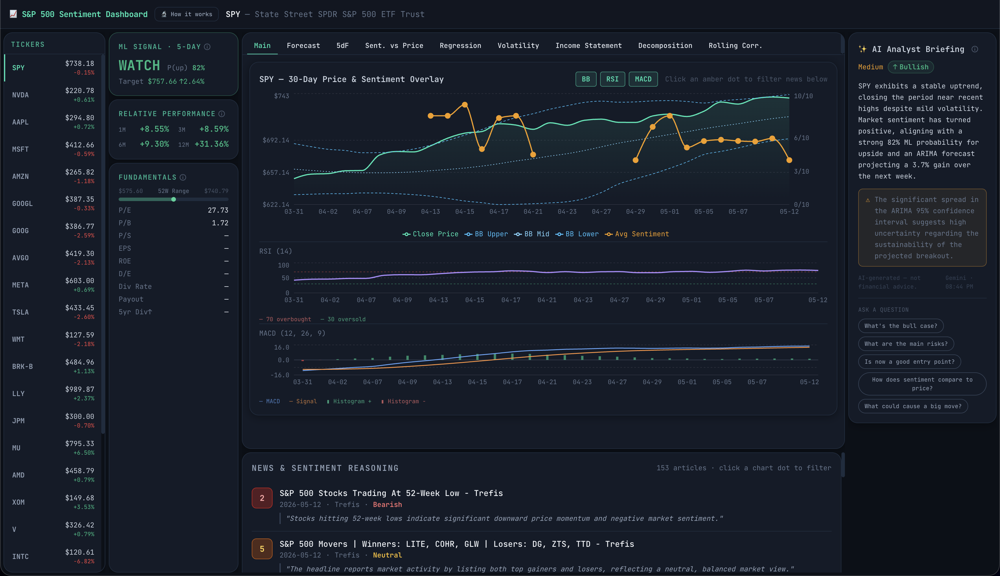

# S&P 500 Sentiment Dashboard

A full-stack analytics dashboard that combines real-time news sentiment, machine learning signals, and time-series analysis for 26 S&P 500 stocks. Built to explore whether AI-scored financial news can meaningfully inform market analysis.

**Live → [sentimentdash.shanksoff.com](https://sentimentdash.shanksoff.com)**



---

## Features

**Sentiment Analysis**
- Scrapes financial RSS feeds (Seeking Alpha, Yahoo Finance, Moomoo, and others) daily for each ticker
- Each headline is scored 1–10 by Gemini AI — 1 = strongly bearish, 10 = strongly bullish
- Daily average sentiment overlaid directly on the price chart as amber dots

**ML Signal — Watch / Hold / Avoid**
- Random Forest classifier trained on 60+ days of price and sentiment features per ticker
- Features: RSI, Bollinger Band position, price momentum (5d/10d), rolling sentiment averages
- Outputs a directional signal with probability of an upward move over 5 trading days
- Signal accuracy tracked and displayed in the UI

**ARIMA Price Forecast**
- Auto-ARIMA model fit to 60 days of closing prices, forecasting 7 trading days ahead
- 95% confidence interval shown — widens with recent volatility
- Momentum drift applied so forecasts reflect recent trend direction

**Time-Series Analysis**
- **STL Decomposition** — breaks price into trend, weekly seasonal, and residual components using LOESS smoothing
- **Rolling Correlation** — 14-day and 30-day Pearson correlation between sentiment and same-day returns, showing whether the sentiment signal is currently predictive

**Regression Analysis**
- Scatter plot of daily sentiment vs next-day price return with OLS regression line
- R² and p-value displayed — quantifies how much sentiment explains return variance

**Volatility**
- 30-day rolling annualised volatility with colour-coded risk bands (low / moderate / high)

**Fundamentals**
- P/E, P/B, P/S, EPS, ROE, D/E, dividend data, 52-week range bar
- Sourced from Yahoo Finance

**AI Analyst Briefing**
- Gemini AI synthesises price action, sentiment, forecast, and ML signal into a short natural-language briefing
- Tone (Bullish / Neutral / Bearish) and confidence level inferred from data
- Includes an interactive Q&A: ask follow-up questions about any ticker with streaming responses

---

## Tech Stack

| Layer | Technology |
|---|---|
| Frontend | React 18, Vite, Tailwind CSS, Recharts |
| Backend | Python, FastAPI, Uvicorn |
| Database | PostgreSQL |
| AI / ML | Gemini AI (sentiment scoring + analyst briefing), scikit-learn (Random Forest), statsmodels (STL / ARIMA), pmdarima (auto-ARIMA) |
| Data | Yahoo Finance (price + fundamentals), RSS feeds (news) |
| Infrastructure | Docker Compose, nginx, GitHub Actions CI/CD |

---

## Architecture

```
RSS Feeds ──► scheduler.py ──► PostgreSQL ◄── Yahoo Finance
                                    │
                              FastAPI (main.py)
                                    │
                            analytics.py
                         (ARIMA · RF · STL · regression · rolling corr)
                                    │
                           React Frontend
                         (Vite dev / nginx prod)
```

- **`scheduler.py`** runs daily — scrapes RSS feeds, scores headlines with Gemini, resolves ML prediction outcomes, refreshes price data
- **`analytics.py`** — all statistical models (pure Python, no heavy framework dependency)
- **`main.py`** — FastAPI REST API, serves all data to the frontend
- **Frontend** — single-page React app, 4-column desktop layout with full mobile support

---

## Running Locally

### Prerequisites
- Python 3.11+
- Node.js 20+
- PostgreSQL
- Gemini API key ([get one free](https://aistudio.google.com/))

### 1. Clone and install

```bash
git clone https://github.com/shanksoff/sentimentdash.git
cd sentimentdash

# Python deps
pip install -r requirements.txt

# Frontend deps
cd frontend && npm install && cd ..
```

### 2. Configure environment

```bash
cp .env.example .env
# Fill in: POSTGRES_*, GEMINI_API_KEY
```

### 3. Initialise the database

```bash
psql -U postgres -d your_db -f init_db.sql
```

### 4. Start the backend

```bash
uvicorn main:app --reload --port 8000
```

### 5. Start the frontend

```bash
cd frontend
npm run dev
# → http://localhost:5173
```

The frontend proxies `/api/*` to `localhost:8000` via Vite config.

### 6. (Optional) Run the scheduler once to seed data

```bash
python scheduler.py --once
```

---

## Methodology

All models and data sources are explained in detail inside the dashboard via the **🔬 How it works** button in the top header. Summary:

| Model | Approach |
|---|---|
| Sentiment scoring | Gemini AI scores each headline 1–10 on a bullish–bearish scale |
| ML Signal | Random Forest classifier on price + sentiment features, 5-day horizon |
| Forecast | Auto-ARIMA on 60 days of closing prices, 7-day horizon |
| Decomposition | STL with LOESS smoothing, period = 5 trading days |
| Rolling correlation | Pearson correlation in a rolling window (14d / 30d) |
| Regression | OLS: daily sentiment → next-day log return |

---

## Tracked Tickers

26 S&P 500 constituents across sectors:

`SPY` `NVDA` `AAPL` `MSFT` `AMZN` `GOOGL` `GOOG` `AVGO` `META` `TSLA` `WMT` `BRK-B` `LLY` `JPM` `MU` `AMD` `XOM` `V` `INTC` `ORCL` `NFLX` `COST` `UNH` `MA` `PG` `JNJ`

---

## Disclaimer

This dashboard is an experimental research project. All outputs — including sentiment scores, ML signals, AI briefings, and price forecasts — are generated by statistical models and AI systems and **do not constitute financial advice**. Past signal accuracy does not guarantee future performance. Do not make investment decisions based on this tool.

---

## License

MIT
